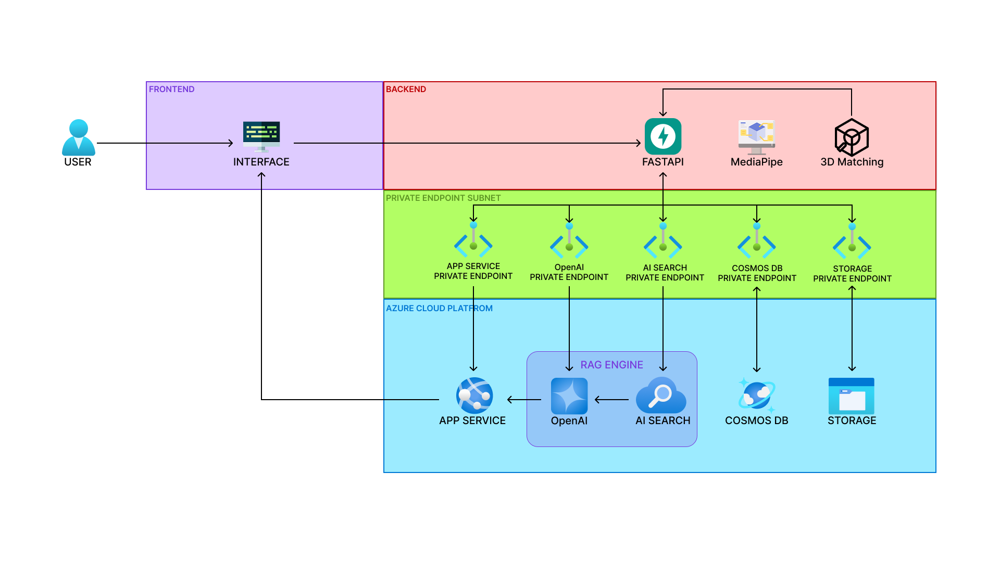

# TerryPiQ 🐭

> **통증을 말하고 사진을 찍으면, AI가 내 체형의 3D 모델로 키네시올로지 테이핑을 안내합니다**

MS AI School 9기 · 2차 학습 프로젝트 · 호잭+파이브팀

---

## 프로젝트 소개

키네시올로지 테이핑은 피부와 유사한 탄성의 테이프로 근육·관절을 지지하는 예방적 셀프케어 기법입니다.
**$412M 규모의 시장**임에도 "내 몸에 맞게 알려주는 서비스"는 없었습니다.

TerryPiQ는 사용자의 통증 증상과 체형 사진을 분석해, 본인과 가장 유사한 3D 체형 모델 위에 테이핑 위치와 방법을 시각화하여 제공합니다.

### 핵심 플로우

```
챗봇 증상 수집 (GPT-4.1)
    → 사진 + 체형 매칭 (MediaPipe + 3D 추천 알고리즘)
        → 3D 테이핑 가이드 (RAG + Blender mesh)
```

---

## 화면 구성

| 단계               | 설명                                    |
| ------------------ | --------------------------------------- |
| **01 부위 선택**   | 통증 부위 선택                          |
| **02 상황 선택**   | 운동 전·중·후 상황 선택                 |
| **03 증상 입력**   | 자연어 1회 입력 (챗봇)                  |
| **04 분석 / 결과** | AI가 체형 매칭 후 테이핑 방법 자동 생성 |
| **05 방법 선택**   | 3D 모델 기반 가이드 + 영상 확인         |

- 성별 미제공 시 중립 기본 모델 **"Terry"** 제공 (Privacy ↔ Inclusiveness 균형)
- 급성 부상 분기, 재시작 권리 등 **선택하지 않을 권리** UX 구현

---

## 기술 스택

### Frontend


### Backend


### AI / ML


### Azure Cloud


### 3D


---

## 시스템 아키텍처



```
USER
 │
 ▼
[React Frontend]
 │                          │
 │ JUDGMENT PATH            │ DELIVERY PATH
 ▼                          ▼
[FastAPI Backend]       [Azure Blob Storage]
 ├── API 01 증상 분석        └── .glb / .mp4 직접 서빙 (CORS)
 ├── API 02 체형 매칭             (Netflix·YouTube 분리 구조)
 ├── API 03 테이핑 추천
 │    ├── GPT (Azure OpenAI)
 │    ├── Azure AI Search (RAG · Vector)
 │    └── Cosmos DB (NoSQL)
 └── Private Endpoint Subnet
```

### RAG 파이프라인

```
[INDEXING - 1회]
Azure Blob (.txt) → GPT-4.1 enrich → MarkdownNode Parse
    → AI Search (leaf + vector 검색 인덱스)
    → Docstore (parent nodes · AutoMerge)

[RUNTIME - 실시간]
사용자 한국어 질문
    → EP1 Symptom Analyze (session_id 생성)
    → EP2 Body Match (model_id 생성, 선택)
    → EP3 RAG + LLM: 번역(ko→en) → AutoMerge 검색 → LLM 생성
    → JSON + Video + 3D GLB 가이드 출력
```

---

## CV 체형 매칭 알고리즘

**STAGE 1 — 골격 + 굵기 추출**

- MediaPipe Pose: 어깨·골반·무릎·발목 관절 비율 계산
- Segmentation: 가슴·허리·골반·허벅지 폭(Width) 추출

**STAGE 2 — 3D 모델 매칭**

- 신체 비율 + 굵기 정보 결합 → 1차 shape score 산출
- 키·몸무게 기반 2차 보정 (약한 고유 신호 → 강한 일반 신호)
- AI Hub 「한국인 3D 신체 스캔」 데이터 530명 활용

**3D 테이핑 시각화**

- CONFORM(1차 수직 투영) → RetopoFlow(2차 곡면 보정) → Bake(텍스처 압축)

---

## RAG 평가 (RAGAS)

| 지표              | 점수     | 설명                              |
| ----------------- | -------- | --------------------------------- |
| faithfulness      | **1.00** | 검색 문서 기반 답변               |
| answer_relevancy  | **1.00** | 질문 관련성                       |
| context_precision | **0.89** | 검색 청크 정밀도                  |
| context_recall    | 0.54     | 자가 채점 과적합 신호 → 개선 예정 |

---

## RAI (Responsible AI) 원칙 적용

- **Privacy & Security**: 체형 정보 분석 후 즉시 삭제, 성별 미제공 옵션 제공
- **Inclusiveness**: 중립 기본 모델 Terry (median BMI + median height 기반 설계)
- **Transparency**: 확정·감정·AI 주어 표현 제거, 한계 명시
- EU AI Act (High-Risk) · GDPR Data Minimization · MS Responsible AI Standard 준수

---

## 주요 의사결정 (트러블슈팅)

| #   | 버린 것                               | 이유                                        | 채택                         |
| --- | ------------------------------------- | ------------------------------------------- | ---------------------------- |
| 01  | 문헌 기반 가중치 (장골 비율 1위 가정) | PCA 재검증 결과 몸통 굵기가 핵심            | 데이터 기반 가중치 재조정    |
| 02  | ArUco 마커 기반 체형 측정             | 마커 출력·촬영 유저 부담                    | MediaPipe 기반 매칭으로 전환 |
| 03  | AI 거절 응답("전문가 상담")           | AI 거절 → 치료 부족 35% 증가 (Jabbour 2025) | 병원 안내 + 계속 선택권 제공 |

---

## 팀 구성

| 역할         | 이름 | 담당                         |
| ------------ | ---- | ---------------------------- |
| 팀장 · PO    | 지원 | 아이템 선정, 프로젝트 고도화 |
| 백엔드       | 용주 | 아키텍처, QA                 |
| CV           | 호진 | 3D 모델링, AI 매칭 로직      |
| LLM 엔지니어 | 경민 | 데이터 처리, RAG 파이프라인  |
| 프론트엔드   | 은민 | UX, 화면 구현                |
| 테크니컬 PM  | 경아 | 기술 리서치, 시스템 설계     |

---

## 향후 계획

**Phase 1 (배포 직후)**

- 블로커 버그 해결
- RAGAS context_recall 개선
- RAG 소스 다원화 (저작권 이슈 해결)

**Phase 2 (서비스 확장)**

- 테이핑 지원 부위 확장
- 데이터셋 확대 (고령층, 다양한 BMI)
- 체형 아웃라이어 대응
